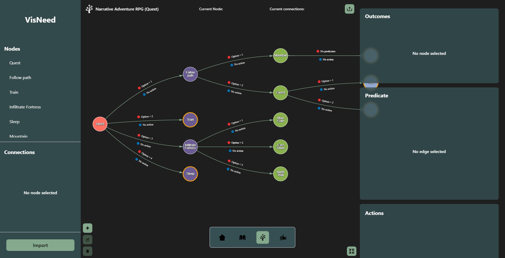

  

<h1 align="center">VisNeed</h1>

---

A Visual Platform for Modeling and Editing Decision Trees for Interactive Applications  

## 📚 Table of Contents

- [Table of Contents](#table-of-contents)
- [About ](#about-)
- [Download ](#download-)
- [Video](#video-)
- [Authors ](#authors-)
<!-- - [Acknowledgments](#acknowledgement) -->

## 🧠 About 

VisNeed is an interactive platform designed to make the decision tree editor NEED, developed
by Barbosa and Rodrigues (2025), more accessible and user-friendly for a broader audience,
particularly for users without a background in computing. While NEED provides a formal
and robust editor for defining, modifying, and exporting decision trees in standardized formats,
VisNeed aims to complement these functionalities by acting as a more intuitive and easy-to-use
visualizer and editor. One of the key objectives of VisNeed is to facilitate the adoption of NEED
by combining advanced visualization, interactivity, and customization practices. Additionally,
it seeks to support various modeling scenarios, such as gameplay design in digital games and
interactive applications, thereby extending its utility to researchers and developers. Inheriting
structural characteristics from NEED, VisNeed will enable integration with game engines and
other computational platforms, offering greater practicality and flexibility in the creation and use
of decision trees.

## 🛠️ Technologies
VisNeed is built with modern web and desktop technologies:

- Electron — for building cross-platform desktop apps

- JavaScript & TypeScript — core programming languages

- React — for building the UI

- Tailwind CSS — for styling with utility-first approach

## 🎥 Video 
https://zenodo.org/records/15454575

## Download (open source code) 

 https://zenodo.org/records/15459896

## 📰 Publication 
This software has been featured in the following scientific publication:

> **Eduardo Miyake, Rafael Garcia Barbosa, and Andréa M. Rodrigues.**  
> *VIS-NEED: A Visual Platform for Modeling and Editing Decision Trees for Interactive Applications.*  
> In: *Proceedings of the 14th Workshop on Software Engineering for Games (SE4Games 2025)*, part of *CBSoft 2025*.  
> Sociedade Brasileira de Computação (SBC), 2025.  
> [Read the full paper here →](https://sol.sbc.org.br/index.php/se4games/article/view/36934)

## 👤 Authors 

- [@duduMiyake](https://github.com/duduMiyake)
- Rafael Garcia Barbosa
- [@mandreia](https://github.com/mandreia)

